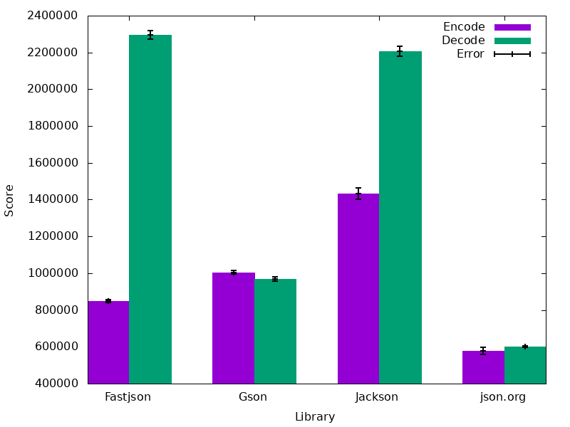

# jsonbenchmarks
> Benchmarks for various Java JSON libraries

## Usage

```
mvn clean install
java -jar target/benchmarks.jar -i 10 -f 3
```

## Results

Tested on a quiet system with following specs:

* OpenJDK 1.8.0\_141 64-bit
* Fedora 26
* Ryzen 1700 @ 3.8GHz

```
Benchmark                           Mode  Cnt        Score       Error  Units
FastjsonBenchmark.benchmarkDecode  thrpt   30   848933.590 ±  8829.303  ops/s
FastjsonBenchmark.benchmarkEncode  thrpt   30  2294795.689 ± 22700.557  ops/s
GsonBenchmark.benchmarkDecode      thrpt   30  1004904.229 ±  9308.420  ops/s
GsonBenchmark.benchmarkEncode      thrpt   30   968026.305 ± 11180.387  ops/s
JacksonBenchmark.benchmarkDecode   thrpt   30  1431939.227 ± 31333.794  ops/s
JacksonBenchmark.benchmarkEncode   thrpt   30  2207671.946 ± 27725.673  ops/s
JsonOrgBenchmark.benchmarkDecode   thrpt   30   577231.263 ± 20107.804  ops/s
JsonOrgBenchmark.benchmarkEncode   thrpt   30   602202.069 ±  4063.416  ops/s
```



## License

Licensed under the Apache License Version 2.0
